# Sentinel Mesh

<div align="center">

**A local-first, enterprise-grade cybersecurity operations platform that combines security analysis, attack-path modelling, distributed agent management, incident response, controlled remediation, governance, and production-readiness workflows in a single modular architecture.**

[](https://www.typescriptlang.org/)
[](https://nextjs.org/)
[](https://nodejs.org/)
[](https://www.docker.com/)
[](#architecture)
[](LICENSE)

</div>

---

## Project Links

**Source Code**

https://github.com/Dpehect/Sentinel-Mesh-App

**Figma UI/UX Design**

https://www.figma.com/make/xUUfVbWVQntkWOEKYYpyF5/Sentinel-Mesh-UI-UX-Design?t=4MDQBjgYPLlyK9A8-1

---

# About This Project

Sentinel Mesh is an independent end-to-end software engineering project that I conceived, designed, architected, and developed from the ground up.

I was personally responsible for the complete project lifecycle, including:

- product vision,
- problem definition,
- feature planning,
- technical research,
- system architecture,
- domain modelling,
- information architecture,
- UI/UX design,
- design system creation,
- user-flow design,
- wireframing,
- prototyping,
- frontend development,
- backend development,
- API design,
- component architecture,
- security architecture,
- data modelling,
- worker architecture,
- package design,
- testing strategy,
- deployment design,
- release engineering,
- documentation,
- and portfolio presentation.

Every major product decision, technical concept, interface, workflow, package boundary, security control, screen hierarchy, and implementation direction was created specifically for Sentinel Mesh.

The project was not assembled from a prebuilt dashboard template. Its product structure, design language, architecture, workflows, and codebase were created as a custom system intended to represent a realistic enterprise cybersecurity platform.

The Figma project is the original design foundation of Sentinel Mesh, while the GitHub repository contains the full engineering implementation.

---

# Executive Summary

Sentinel Mesh is designed to solve a common problem in modern security platforms: security data is often fragmented across independent scanners, dashboards, alert feeds, deployment systems, and compliance tools.

Traditional security products may identify vulnerabilities, but they frequently fail to answer the operational questions that matter most:

- Is the issue actually reachable?
- What technical evidence supports the finding?
- Which identity, asset, service, or trust boundary is affected?
- How should the remediation be prioritised?
- Can the fix be deployed safely?
- Who approved the operation?
- What happens if the deployment fails?
- Can the entire process be audited later?
- Can the system recover without corrupting operational state?

Sentinel Mesh addresses these problems through a unified security control plane.

The platform connects:

```text
Detection
    ↓
Evidence
    ↓
Context
    ↓
Risk Prioritisation
    ↓
Attack-Path Analysis
    ↓
Remediation Planning
    ↓
Controlled Rollout
    ↓
Incident Response
    ↓
Audit and Recovery
```

The result is a security platform that treats findings as part of an operational lifecycle rather than isolated alerts.

---

# Core Product Vision

Sentinel Mesh is built around five principles.

## 1. Explainable Security

Security decisions should include evidence, reasoning, confidence, affected assets, and remediation context.

## 2. Local-First Operation

Core workflows should remain usable without forcing the organisation to depend on a paid cloud provider.

## 3. Controlled Automation

Automation should be constrained by policies, approval gates, rate limits, cooldowns, health checks, and rollback conditions.

## 4. Modular Architecture

Each major capability should exist as an independently testable domain package with explicit boundaries.

## 5. Operational Accountability

Every important action should be traceable, reviewable, recoverable, and suitable for audit.

---

# Main Capabilities

## Security Command Center

The main web application acts as a unified operational interface for:

- security posture,
- active findings,
- attack paths,
- scans,
- assets,
- projects,
- intelligence,
- incidents,
- agent fleets,
- rollout operations,
- compliance,
- enterprise governance,
- platform health,
- release readiness,
- backups,
- and security hardening.

The command center is designed around operational priorities instead of decorative metrics.

It helps users answer:

- What is the current risk?
- What should be investigated first?
- Which attack paths are most dangerous?
- Which systems are degraded?
- Which rollout requires approval?
- Which incidents are active?
- Is the platform ready for release?

---

## Evidence-Aware Security Analysis

Sentinel Mesh is designed to enrich findings with technical context.

A finding can include:

- source location,
- sink location,
- code evidence,
- data-flow information,
- severity,
- confidence,
- CWE classification,
- OWASP mapping,
- affected component,
- ownership,
- business impact,
- remediation guidance,
- and lifecycle state.

The purpose is to avoid presenting security results as unexplained red or orange badges.

Each result should help a developer or analyst understand:

- what happened,
- why it matters,
- where it originated,
- how it can be exploited,
- and how it should be resolved.

---

## Attack-Path Analysis

The attack-path engine connects individual risks into meaningful security paths.

It can represent relationships between:

- public entry points,
- applications,
- services,
- identities,
- secrets,
- databases,
- cloud resources,
- network zones,
- containers,
- endpoints,
- and business-critical assets.

Example:

```text
Public API
    ↓
Weak Authentication
    ↓
Leaked Service Credential
    ↓
Privileged Cloud Identity
    ↓
Production Database
```

This enables a more realistic prioritisation model.

A medium-severity finding may become critical if it participates in a reachable path to a sensitive asset.

---

## Security Finding Lifecycle

Findings are treated as stateful objects rather than static scan results.

Typical lifecycle:

```text
Detected
    ↓
Triaged
    ↓
Assigned
    ↓
In Remediation
    ↓
Verified
    ↓
Resolved
```

The lifecycle can support:

- assignment,
- ownership,
- status transitions,
- verification,
- false-positive handling,
- suppression,
- reopening,
- and historical tracking.

---

## Risk Scoring

Sentinel Mesh includes risk-oriented domain packages intended to combine multiple signals.

Potential inputs include:

- technical severity,
- exploitability,
- reachability,
- asset criticality,
- identity privilege,
- internet exposure,
- threat intelligence,
- control effectiveness,
- confidence,
- and attack-path participation.

The system is designed to prefer explainable risk calculations over black-box scores.

---

## Source and Application Security

The platform architecture includes support for:

- source-code analysis,
- source-to-sink evidence,
- secret detection,
- dependency scanning,
- supply-chain security,
- CI/CD security,
- pull-request analysis,
- vulnerability prioritisation,
- detection-as-code,
- and remediation workflows.

Optional adapters can integrate established tools such as:

- Semgrep,
- Gitleaks,
- OSV-based dependency analysis.

These tools are treated as extensible adapters rather than hard requirements.

---

## Cloud, Container, and Infrastructure Security

Sentinel Mesh includes domain packages for:

- cloud posture management,
- Kubernetes security,
- container runtime security,
- external attack-surface management,
- multi-cloud inventory,
- network topology,
- asset discovery,
- network detection and response,
- and endpoint detection and response.

This architecture allows application findings to be correlated with infrastructure context.

---

## Identity Security

Identity is treated as a first-class security domain.

Relevant capabilities include:

- identity governance,
- privileged identity analysis,
- identity attack paths,
- role awareness,
- credential relationships,
- user and entity behaviour analytics,
- and advanced UEBA concepts.

This is important because many realistic attack paths rely on identity escalation rather than a single software vulnerability.

---

## Threat Intelligence and Detection

The project architecture includes:

- threat-intelligence processing,
- IOC context,
- detection-as-code,
- SIEM correlation,
- MITRE ATT&CK coverage,
- threat hunting,
- attack simulation,
- SOC analyst workflows,
- and case management.

These modules are intended to connect proactive detection, analyst investigation, and operational response.

---

# Distributed Agent Architecture

Sentinel Mesh contains a substantial secure-agent architecture for distributed collection and controlled defensive operations.

The agent lifecycle includes:

- secure enrolment,
- identity establishment,
- certificate issuance,
- key rotation,
- secrets handling,
- policy distribution,
- telemetry integrity,
- runtime attestation,
- command validation,
- secure updates,
- self-protection,
- health scoring,
- and remediation planning.

---

## Secure Agent Enrolment

An agent should not become trusted simply because it connects to the control plane.

Secure enrolment can include:

- one-time enrolment tokens,
- short-lived credentials,
- certificate issuance,
- identity binding,
- environment validation,
- and enrolment audit records.

---

## Telemetry Integrity

Agent telemetry can be protected through:

- signatures,
- sequence numbers,
- replay detection,
- integrity hashes,
- clock validation,
- and identity verification.

This reduces the risk of accepting forged, duplicated, or reordered telemetry.

---

## Runtime Attestation

The runtime-attestation model can evaluate whether an agent is operating in an expected environment.

Potential signals include:

- binary identity,
- runtime version,
- host properties,
- policy version,
- certificate status,
- configuration state,
- and health indicators.

---

## Agent Self-Protection

Agent self-protection concepts include:

- integrity monitoring,
- configuration validation,
- restricted update channels,
- process-health checks,
- protected local secrets,
- and tamper response.

---

## Offline Queue and Bandwidth Governance

Agents may operate in unstable or bandwidth-limited environments.

The architecture includes concepts for:

- offline event queues,
- retry control,
- queue limits,
- event prioritisation,
- bandwidth budgets,
- adaptive upload scheduling,
- and backpressure.

---

## Adaptive Scheduling

Agent tasks can be scheduled based on:

- health,
- priority,
- resource availability,
- bandwidth,
- maintenance windows,
- policy,
- and operational risk.

This prevents every agent from executing expensive operations at the same time.

---

## Health Scoring and Remediation

Agent health can be calculated from signals such as:

- telemetry freshness,
- certificate validity,
- policy version,
- runtime integrity,
- queue state,
- update status,
- and operational errors.

The remediation engine can then produce constrained defensive recommendations.

Examples:

- refresh policy,
- rotate credentials,
- re-attest runtime,
- restart a local service,
- quarantine an agent,
- or request human review.

High-impact operations can require explicit approval.

---

# Fleet Orchestration

Sentinel Mesh treats fleet operations as structured workflows.

## Canary Selection

The system can select a deterministic subset of agents for the first rollout wave.

This enables:

- controlled validation,
- repeatable planning,
- predictable risk,
- and easier debugging.

## Staged Waves

Agents can be grouped into rollout waves based on:

- region,
- health,
- environment,
- criticality,
- labels,
- and policy.

## Concurrency Limits

The rollout engine can enforce:

- global concurrency limits,
- per-region concurrency limits,
- and canary-size restrictions.

## Maintenance Windows

Operational changes can be restricted to approved time windows.

## Circuit Breakers

A rollout can pause automatically when:

- failure rate exceeds a threshold,
- agent health degrades,
- canary success requirements are not met,
- audit integrity fails,
- or an approval is missing.

---

# Rollout State Machine

A rollout can move through controlled states such as:

```text
Draft
    ↓
Awaiting Approval
    ↓
Approved
    ↓
Running
    ↓
Paused
    ↓
Completed
```

Failure paths may include:

```text
Running
    ↓
Failed
    ↓
Rolling Back
    ↓
Recovered
```

State changes can use optimistic concurrency to prevent stale operators from overwriting newer decisions.

---

# Approval Workflow

Production-sensitive operations can require approval.

An approval record can include:

- rollout ID,
- actor,
- decision,
- timestamp,
- expected version,
- reason,
- and audit metadata.

This makes approval part of the system model rather than an informal external process.

---

# Recovery Checkpoints

Before a risky operation, the platform can create a recovery checkpoint.

A checkpoint can include:

- rollout state,
- current version,
- active wave,
- agent results,
- metadata,
- timestamp,
- creator,
- and integrity checksum.

Recovery restores the operation into a safe paused state rather than automatically continuing execution.

---

# Tamper-Evident Audit Chain

Sentinel Mesh includes an audit-chain design for high-value operational events.

The model uses:

- canonical serialisation,
- SHA-256 payload hashes,
- previous-record hash linking,
- HMAC-SHA256 signatures,
- strict sequence validation,
- duplicate idempotency-key detection,
- timestamp validation,
- and constant-time signature comparison.

Example:

```text
Record 1
  hash: A1
  previous: GENESIS

Record 2
  hash: B2
  previous: A1

Record 3
  hash: C3
  previous: B2
```

Changing a previous record invalidates the chain.

When integrity verification fails, the control plane can:

- reject the event,
- pause a rollout,
- require investigation,
- or prevent further transitions.

---

# Security Operations Center

The operations center unifies:

- incident management,
- team access,
- system health,
- alerts,
- notification policies,
- rollout status,
- and operational evidence.

---

## Incident Model

An incident can include:

- title,
- description,
- severity,
- source,
- status,
- assignment,
- tags,
- version,
- created time,
- and updated time.

Severity levels:

```text
Critical
High
Medium
Low
```

Lifecycle:

```text
Open
    ↓
Investigating
    ↓
Contained
    ↓
Resolved
```

---

## Notification Rules

Notification policies can define:

- severity filters,
- channels,
- cooldown periods,
- enablement state,
- and rule ownership.

Supported decision channels can include:

- in-application alerts,
- email,
- and webhooks.

The architecture separates the decision to notify from the external delivery provider.

---

## Platform Health

Health snapshots can track:

- web application,
- worker,
- queue,
- database,
- rollout store,
- agent fleet,
- and scanner services.

Each component can report:

- state,
- latency,
- timestamp,
- and diagnostic details.

---

# Team and Role Management

Sentinel Mesh includes a role-based operations model.

| Role | Responsibility |
|---|---|
| Owner | Full administration and ownership |
| Security Admin | Security policy and access management |
| Analyst | Investigation and incident operations |
| Operator | Operational transitions and health management |
| Viewer | Read-only access |

The permission model is designed to keep high-impact operations separate from ordinary observation.

---

# Enterprise Architecture

The enterprise layer includes concepts for:

- multi-tenancy,
- tenant isolation,
- scoped API tokens,
- role hierarchies,
- policy enforcement,
- compliance evidence,
- quota management,
- identity governance,
- and auditability.

The local-first design allows demonstration and self-hosted use without requiring an external enterprise identity vendor.

---

# Compliance and Governance

The project includes domain concepts for:

- policy evaluation,
- compliance mapping,
- evidence collection,
- continuous compliance,
- reporting,
- audit records,
- and governance workflows.

Potential framework mappings may include:

- OWASP,
- CWE,
- MITRE ATT&CK,
- SOC 2,
- ISO 27001,
- NIST,
- and organisation-specific policy sets.

---

# GitHub Integration

Sentinel Mesh includes a GitHub-oriented security workflow.

Capabilities include:

- GitHub App integration,
- installation handling,
- webhook verification,
- pull-request analysis,
- incremental scanning,
- Check Runs,
- merge-gate decisions,
- and repository onboarding.

Typical workflow:

```text
Pull Request Opened
    ↓
Webhook Verified
    ↓
Changed Files Analysed
    ↓
Security Findings Generated
    ↓
Check Run Published
    ↓
Merge Policy Evaluated
```

---

# Plugin Architecture

The platform uses a plugin-oriented approach for extending scanner and integration behaviour.

The plugin architecture can support:

- typed contracts,
- isolated scanner adapters,
- metadata,
- capability declarations,
- configuration schemas,
- and result normalisation.

This allows new security engines to be added without tightly coupling them to the web application.

---

# Architecture

## Monorepo Structure

```text
Sentinel-Mesh-App/
├── apps/
│   ├── web/
│   └── worker/
├── packages/
│   ├── security-core/
│   ├── evidence-engine/
│   ├── attack-path-engine/
│   ├── policy-engine/
│   ├── audit-engine/
│   ├── compliance-engine/
│   ├── scanner-runner/
│   ├── db/
│   └── many additional domain packages
├── plugins/
├── examples/
├── docs/
├── scripts/
├── release/
├── docker-compose.yml
├── docker-compose.production.yml
└── package.json
```

---

## Workspace Design

The root workspace manages:

```text
apps/*
packages/*
plugins/*
```

This architecture provides:

- shared tooling,
- isolated package boundaries,
- central build scripts,
- consistent type checking,
- independent tests,
- and reusable domain logic.

---

## Application Layer

### Web Application

The web application is responsible for:

- dashboards,
- route handlers,
- user-facing workflows,
- command center,
- operational views,
- configuration,
- and API access.

### Worker Application

The worker application is responsible for:

- background processing,
- scan execution,
- queue consumption,
- scheduled jobs,
- and long-running operations.

---

## Domain Packages

The package layer contains reusable security and operational logic.

Examples include:

- security core,
- evidence engine,
- attack-path engine,
- policy engine,
- audit engine,
- quota engine,
- observability engine,
- disaster recovery,
- incident response,
- threat intelligence,
- secure agent packages,
- multi-tenant core,
- and AI intelligence.

This keeps security logic outside page components and route handlers.

---

# Technology Stack

## Frontend

- Next.js App Router
- React
- TypeScript
- Server Components
- Route Handlers
- Responsive CSS
- Component-based design
- Accessible interface patterns

## Backend

- Node.js
- TypeScript
- Worker processes
- Background queue architecture
- API route handlers
- Domain services
- Local-first persistence options

## Data and Infrastructure

- PostgreSQL
- Redis or Valkey
- Docker
- Docker Compose
- Local JSON persistence for selected workflows
- Environment-based configuration

## Testing

- Vitest
- Playwright
- strict TypeScript type checking
- static repository verification
- integration testing
- end-to-end testing
- benchmark scripts

## Delivery

- GitHub Actions
- Docker release profiles
- release manifests
- source packaging
- production checklists
- build verification
- SHA-256 source manifests

---

# Design System

I designed the complete UI/UX system specifically for Sentinel Mesh.

The design system includes:

- colour tokens,
- semantic status colours,
- typography hierarchy,
- spacing scale,
- card system,
- navigation system,
- table patterns,
- dashboard layouts,
- form controls,
- incident cards,
- severity labels,
- health indicators,
- rollout views,
- audit timelines,
- empty states,
- error states,
- loading states,
- responsive behaviour,
- and accessibility considerations.

The design was created to communicate:

- trust,
- precision,
- intelligence,
- clarity,
- speed,
- and operational confidence.

---

# UI/UX Design Ownership

The full product design was created by me.

I personally designed:

- the product information architecture,
- global navigation,
- page hierarchy,
- user journeys,
- command center,
- dashboard structure,
- security workflows,
- finding views,
- attack-path views,
- incident flows,
- agent-management screens,
- rollout screens,
- team-management screens,
- system-health screens,
- security-hardening screens,
- component behaviour,
- responsive rules,
- and the visual design language.

The Figma file is not a generic dashboard mockup. It represents the original visual system created specifically for this project.

Figma:

https://www.figma.com/make/xUUfVbWVQntkWOEKYYpyF5/Sentinel-Mesh-UI-UX-Design?t=4MDQBjgYPLlyK9A8-1

---

# Engineering Ownership

I independently implemented the full engineering direction of Sentinel Mesh.

My responsibilities included:

## Product

- defining the problem,
- defining the target user,
- planning the feature set,
- creating the product architecture,
- and defining operational workflows.

## Design

- designing every major screen,
- creating the design system,
- defining component behaviour,
- creating interaction flows,
- and preparing the Figma prototype.

## Frontend

- building the Next.js interface,
- structuring routes,
- creating reusable components,
- implementing responsive layouts,
- and connecting UI flows to domain logic.

## Backend

- designing APIs,
- modelling state transitions,
- creating worker workflows,
- implementing storage adapters,
- and defining operational services.

## Security

- defining the trust model,
- designing agent security,
- adding integrity controls,
- modelling approval flows,
- implementing audit concepts,
- and creating production-hardening policies.

## Architecture

- designing the monorepo,
- creating package boundaries,
- separating domain logic,
- defining build order,
- and creating reusable contracts.

## Quality

- writing tests,
- defining type-checking workflows,
- creating static verification scripts,
- and structuring release validation.

## DevOps and Release

- preparing Docker workflows,
- creating CI concepts,
- defining release manifests,
- preparing packaging scripts,
- and documenting deployment requirements.

## Documentation

- writing technical documentation,
- describing architecture,
- documenting phases,
- and preparing the project for portfolio presentation.

---

# Security Model

Sentinel Mesh assumes that the security platform itself is a high-value target.

The architecture applies defence-in-depth principles.

## Core Controls

- least privilege,
- explicit trust,
- secure agent identity,
- version-guarded updates,
- auditability,
- approval gates,
- rate limiting,
- secure response headers,
- no-store policies,
- integrity validation,
- safe backups,
- and constrained remediation.

## Production Headers

The hardening layer can define:

- Content Security Policy,
- HSTS,
- frame protection,
- MIME sniffing protection,
- referrer policy,
- permissions policy,
- cross-origin opener policy,
- and cross-origin resource policy.

## Rate Limiting

Sensitive endpoints can enforce request budgets and retry windows.

## Audit Logging

Security-relevant actions can be stored as append-only JSON-line records.

## Cache Discipline

Sensitive APIs use private, no-store cache policies.

---

# Backup and Recovery

The release-readiness layer supports:

- local backup generation,
- SHA-256 file checksums,
- backup manifest checksums,
- safe restore,
- path traversal prevention,
- non-destructive restore by default,
- and explicit overwrite control.

Typical backup targets include:

- operations state,
- rollout state,
- configuration metadata,
- and local audit evidence.

---

# Release Readiness

Sentinel Mesh includes production-readiness concepts such as:

- Node.js version validation,
- writable data-directory checks,
- session-secret verification,
- platform-health validation,
- backup verification,
- required and recommended checks,
- and weighted readiness scoring.

---

# Data Flow

```mermaid
flowchart LR
    A[Repository or Asset] --> B[Scanner Runner]
    B --> C[Security Engines]
    C --> D[Evidence Engine]
    D --> E[Finding Lifecycle]
    E --> F[Risk Scoring]
    F --> G[Attack Path Engine]
    G --> H[Policy and Compliance]
    H --> I[Remediation Plan]
    I --> J[Agent Fleet Rollout]
    J --> K[Operations Center]
    K --> L[Audit, Backup and Recovery]
```



---

# Example User Journey

## Repository Security Review

```text
1. User connects or selects a repository
2. Scanner executes configured analysis
3. Findings are normalised
4. Evidence is attached
5. Risk score is calculated
6. Attack paths are generated
7. Findings are prioritised
8. Remediation is planned
9. Security operation is approved
10. Rollout is monitored
11. Incident and audit records are preserved
```

---

# Getting Started

## Requirements

- Node.js 20 or newer
- npm 10 or newer
- Git
- Docker and Docker Compose for full infrastructure

Verify:

```bash
node --version
npm --version
docker --version
```

---

## Clone the Repository

```bash
git clone https://github.com/Dpehect/Sentinel-Mesh-App.git
cd Sentinel-Mesh-App
```

---

## Install Dependencies

```bash
npm install
```

---

## Configure Environment

```bash
cp .env.example .env
```

Typical environment variables:

```env
NODE_ENV=development
NEXT_PUBLIC_APP_URL=http://localhost:3000
SENTINEL_SESSION_SECRET=replace-with-a-long-random-value
DATABASE_URL=postgresql://...
REDIS_URL=redis://localhost:6379
SENTINEL_DATA_ROOT=.sentinel-data
GITHUB_APP_ID=
GITHUB_PRIVATE_KEY=
GITHUB_WEBHOOK_SECRET=
```

Never commit production secrets.

---

## Start Infrastructure

```bash
docker compose up -d postgres redis
```

---

## Database Setup

```bash
npm run db:migrate
npm run db:seed
```

---

## Start Development

```bash
npm run dev
```

Default address:

```text
http://localhost:3000
```

---

# Root Commands

## Development

```bash
npm run dev
npm run dev:web
npm run dev:worker
```

## Build

```bash
npm run build
npm run build:packages
npm run build:apps
```

## Quality

```bash
npm run typecheck
npm run test
npm run lint
npm run test:e2e
```

## Verification

```bash
npm run verify
npm run verify:static
npm run benchmark
```

## Database

```bash
npm run db:migrate
npm run db:seed
```

## Release

```bash
npm run release:source
```

Additional release commands may be available depending on the final applied release configuration.

---

# Testing Strategy

## Unit Testing

Domain packages test deterministic behaviour such as:

- risk scoring,
- policy decisions,
- attack-path creation,
- rollout planning,
- rate limiting,
- agent health,
- audit verification,
- backup validation,
- and incident transitions.

## Integration Testing

Integration tests cover:

- API and domain interaction,
- worker execution,
- persistence,
- scanners,
- and operational state.

## End-to-End Testing

Playwright can validate:

- authentication,
- navigation,
- repository onboarding,
- finding review,
- and operational workflows.

## Static Verification

Static checks validate:

- required files,
- workspace consistency,
- package structure,
- route presence,
- configuration,
- and release layout.

---

# Production Deployment

## Docker Compose

```bash
docker compose -f docker-compose.production.yml up --build
```

If a hardened release profile is available:

```bash
docker compose -f docker-compose.release.yml --env-file .env.release up --build
```

---

# Production Checklist

Before production deployment:

- configure a strong session secret,
- configure PostgreSQL,
- configure Redis or Valkey,
- enable TLS,
- restrict internal services,
- validate webhook secrets,
- verify backup integrity,
- review agent permissions,
- run all tests,
- run type checking,
- run the full build,
- review security headers,
- and confirm platform health.

---

# Observability

The system architecture supports:

- structured logs,
- health checks,
- queue visibility,
- scan events,
- audit logs,
- worker status,
- component latency,
- and release readiness.

---

# Key Engineering Decisions

## Modular Monorepo

Each domain is isolated into a package.

Benefits:

- clearer ownership,
- better testing,
- reduced coupling,
- reusable logic,
- and easier scaling.

## Explainable Security

Findings, scores, and remediation decisions include reasons and evidence.

## Safe Automation

Automation is limited through:

- approval gates,
- cooldowns,
- quotas,
- rate limits,
- maintenance windows,
- and rollback logic.

## Operational Completeness

The platform models the entire security lifecycle:

```text
Detection → Context → Prioritisation → Action → Governance → Recovery
```

## Local-First Flexibility

The product can be developed, demonstrated, and self-hosted without mandatory paid services.

---

# What This Project Demonstrates

Sentinel Mesh demonstrates experience in:

- product thinking,
- software architecture,
- cybersecurity,
- distributed systems,
- full-stack development,
- enterprise UX,
- domain-driven design,
- TypeScript package design,
- secure automation,
- platform engineering,
- CI/CD,
- Docker,
- operational resilience,
- and technical documentation.

---

# Relevant Roles

This project is especially relevant to:

- Full-Stack Engineer
- Senior Frontend Engineer
- Backend Engineer
- Platform Engineer
- Security Engineer
- Application Security Engineer
- DevSecOps Engineer
- Cloud Security Engineer
- Product Engineer
- TypeScript Engineer
- Next.js Engineer
- Technical Product Engineer

---

# Roadmap

Potential future improvements include:

- distributed rate limiting,
- external identity-provider integration,
- SCIM provisioning,
- OpenTelemetry export,
- richer topology visualisation,
- advanced scanner marketplace support,
- signed release artifacts,
- multi-region control-plane support,
- managed deployment templates,
- and deeper SIEM and SOAR integrations.

---

# Documentation

Important documents may include:

```text
docs/ARCHITECTURE.md
docs/THREAT-MODEL.md
docs/RISK-METHODOLOGY.md
docs/SECURITY.md
docs/ROADMAP.md
docs/PLUGIN-AUTHORING.md
docs/adr/
```

---

# Contributing

Recommended workflow:

```bash
git checkout -b feature/your-feature
npm install
npm run typecheck
npm run test
npm run build
```

Before opening a pull request:

- keep package responsibilities focused,
- include tests,
- document security-sensitive decisions,
- avoid committing secrets,
- review operational impact,
- and preserve backwards compatibility.

---

# Responsible Disclosure

Do not report sensitive vulnerabilities through public issues.

Follow the process described in `SECURITY.md`.

---

# License

Sentinel Mesh is licensed under the MIT License.

See [LICENSE](LICENSE).

---

<div align="center">

## Sentinel Mesh

**Designed, architected, and developed independently from product concept to production-oriented implementation.**

Source Code:

https://github.com/Dpehect/Sentinel-Mesh-App

UI/UX Design:

https://www.figma.com/make/xUUfVbWVQntkWOEKYYpyF5/Sentinel-Mesh-UI-UX-Design?t=4MDQBjgYPLlyK9A8-1

</div>
